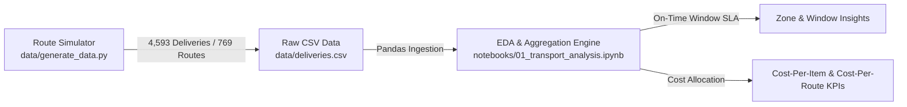

# Transport Performance Analysis 🚚

[](https://www.python.org/)
[](https://pandas.pydata.org/)
[](https://jupyter.org/)
[](https://opensource.org/licenses/MIT)

On-time delivery, cost-per-route analytics, and discrepancy identification for a **B2B/B2C furniture transport operation**. Features synthetic route-level data modeled on real-world delivery rounds (province zones, 2h vs 4h agreed time windows, driver handling times, and transport discrepancy patterns).

---

## 📈 Analysis Pipeline & Flow



---

## 🎯 Key Operational Findings

- **Punctuality Drift Across Stop Sequence**: On-time rate drops from **97% at Stop 1** to **75% by Stop 7** due to cumulative handling delay propagation.
- **B2B vs B2C Failure Modes**: B2B delivery windows (2h) experience severe lateness in far zones (61.0% in Ferrara vs 98.7% in depot city) due to 60+ km outbound legs.
- **Cost Normalization (Per Route vs Per Item)**: Consolidating far-zone deliveries reduces per-item cost despite higher route distance costs.

---

## 🚀 Quickstart

```bash
# 1. Clone repository
git clone https://github.com/nqwrc/transport-performance-analysis.git
cd transport-performance-analysis

# 2. Install requirements & generate reproducible data
pip install -r requirements.txt
python data/generate_data.py

# 3. Launch Jupyter Notebook analysis
jupyter notebook notebooks/01_transport_analysis.ipynb
```

---

## 📝 License

Distributed under the **MIT License**. See [`LICENSE`](LICENSE) for details.
